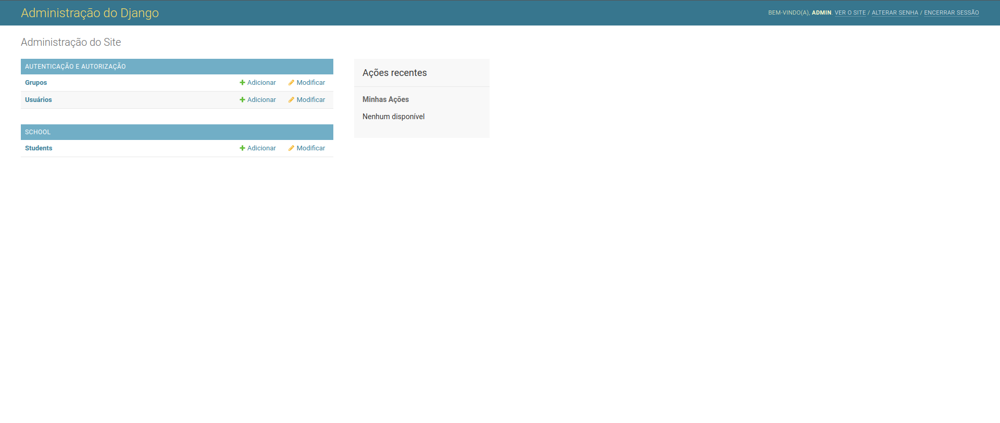

# Django API 💻

<p align="center">
  
  
  
  
</p>

<p align="center">
  <a href="#sobre">Sobre</a> •
  <a href="#django-api">Django API</a> •
  <a href="#instalação">Instalação</a> •
  <a href="#tecnologias">Tecnologias</a> •
  <a href="#autor">Autor</a>  
</p>

## Sobre

Projeto exploratório com a finalidade de entender na pratica como o framework Django funciona.

## Django API

Uma API simples construida com Django Framework com a finalidade de entender como construir API REST com Python utilizando a ferramenta.

A API em si possui apenas um recurso pois a ideia principal era conhecer o framework:



## Instalação

Antes de começar, você vai precisar ter instalado em sua máquina as seguintes ferramentas:
[Git](https://git-scm.com) e [Python](https://www.python.org/). Além disso é bom ter um editor para trabalhar com o código como [VSCode](https://code.visualstudio.com/).

### 🎲 Rodando o Back End (servidor)

```bash
# Clone este repositório
$ git clone git@github.com:MrRioja/djangoAPI.git

# Acesse a pasta do projeto no terminal/cmd
$ cd djangoAPI

# Execute as migrations
$ python3 manage.py migrate

# Execute a API
$ python3 manage.py runserver

# O servidor iniciará na porta 8000 - acesse <http://localhost:8000/admin>
```

## Tecnologias


<br><br><br>

## Autor

<div align="center">

<h1>Luiz Rioja</h1>
<strong>Backend Developer</strong>
<br/>
<br/>

<a href="https://linkedin.com/in/luizrioja" target="_blank">

</a>

<a href="https://github.com/mrrioja" target="_blank">

</a>

<a href="mailto:lulyrioja@gmail.com?subject=Fala%20Dev" target="_blank">

</a>

<a href="https://api.whatsapp.com/send?phone=5511933572652" target="_blank">

</a>

<a href="https://join.skype.com/invite/tvBbOq03j5Uu" target="_blank">

</a>

<br/>
<br/>
</div>
